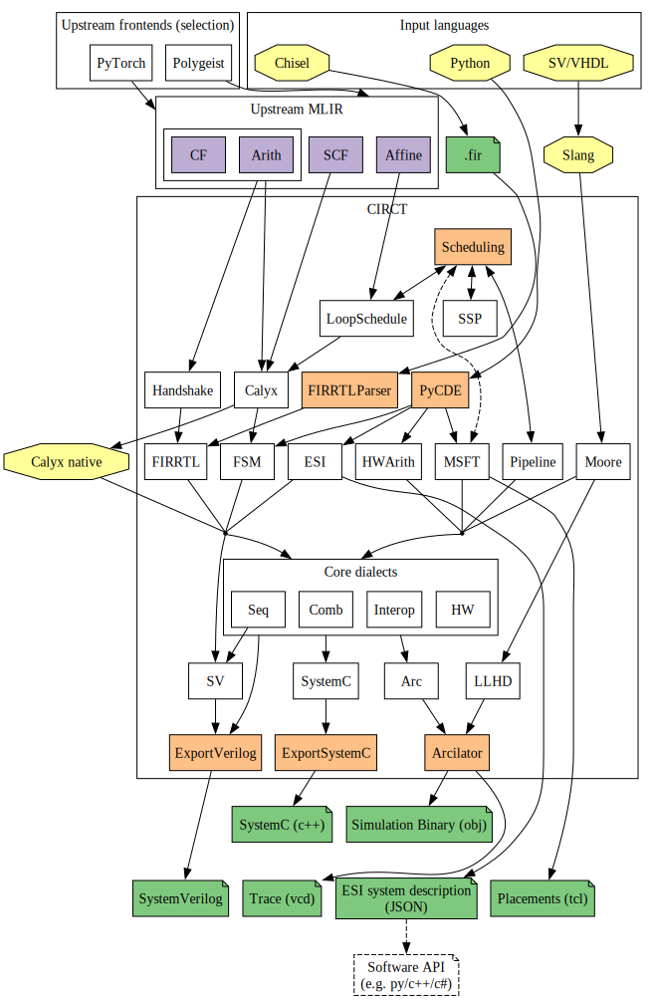

<p align="center"></p>

[](https://github.com/llvm/circt/actions?query=workflow%3A%22Build+and+Test%22)
[](https://github.com/llvm/circt/actions?query=workflow%3A%22Nightly+integration+tests%22)

# ⚡️ "CIRCT" / Circuit IR Compilers and Tools

"CIRCT" stands for "Circuit IR Compilers and Tools".  One might also interpret
it as the recursively as "CIRCT IR Compiler and Tools".  The T can be
selectively expanded as Tool, Translator, Team, Technology, Target, Tree, Type,
... we're ok with the ambiguity.

The CIRCT community is an open and welcoming community.  If you'd like to
participate, you can do so in a number of different ways:

1) Join our [Discourse Forum](https://llvm.discourse.group/c/Projects-that-want-to-become-official-LLVM-Projects/circt/) on the LLVM Discourse server.  To get a "mailing list" like experience click the bell icon in the upper right and switch to "Watching".  It is also helpful to go to your Discourse profile, then the "emails" tab, and check "Enable mailing list mode".

2) Join our weekly video chat.  Please see the
[meeting notes document](https://docs.google.com/document/d/1fOSRdyZR2w75D87yU2Ma9h2-_lEPL4NxvhJGJd-s5pk/edit#)
for more information.

3) Contribute code.  CIRCT follows all of the LLVM Policies: you can create pull
   requests for the CIRCT repository, and gain commit access using the [standard
   LLVM policies](https://llvm.discourse.group/c/Projects-that-want-to-become-official-LLVM-Projects/circt/).

Also take a look at the following diagram, which gives a brief overview of the current [dialects and how they interact](docs/includes/img/dialects.svg):

<p align="center"></p>

## Motivation

The EDA industry has well-known and widely used proprietary and open source
tools.  However, these tools are inconsistent, have usability concerns, and were
not designed together into a common platform.  Furthermore
these tools are generally built with
[Verilog](https://en.wikipedia.org/wiki/Verilog) (also
[VHDL](https://en.wikipedia.org/wiki/VHDL)) as the IRs that they
interchange.  Verilog has well known design issues, and limitations, e.g.
suffering from poor location tracking support.

The CIRCT project is an (experimental!) effort looking to apply MLIR and
the LLVM development methodology to the domain of hardware design tools.  Many
of us dream of having reusable infrastructure that is modular, uses
library-based design techniques, is more consistent, and builds on the best
practices in compiler infrastructure and compiler design techniques.

By working together, we hope that we can build a new center of gravity to draw
contributions from the small (but enthusiastic!) community of people who work
on open hardware tooling.  In turn we hope this will propel open tools forward,
enables new higher-level abstractions for hardware design, and
perhaps some pieces may even be adopted by proprietary tools in time.

For more information, please see our longer [charter document](docs/Charter.md).

## Setting this up

These commands can be used to set this up on a Mac:

1) **Install Dependencies** of LLVM/MLIR according to [the
  instructions](https://mlir.llvm.org/getting_started/), including cmake and ninja.

2) **Check out LLVM and CIRCT repos.**  CIRCT contains LLVM as a git
submodule.  The LLVM repo here includes staged changes to MLIR which
may be necessary to support CIRCT.  It also represents the version of
LLVM that has been tested.  MLIR is still changing relatively rapidly,
so feel free to use the current version of LLVM, but APIs may have
changed.

```
$ git clone git@github.com:circt/circt.git
$ cd circt
$ git submodule init
$ git submodule update
```

*Note:* The repository is set up so that `git submodule update` performs a shallow clone, meaning it downloads just enough of the LLVM repository to check out the currently specified commit. If you wish to work with the full history of the LLVM repository, you can manually "unshallow" the the submodule:

```
$ cd llvm
$ git fetch --unshallow
```

3) **Build and test LLVM/MLIR:**

```
$ cd circt
$ mkdir llvm/build
$ cd llvm/build
$ cmake -G Ninja ../llvm \
    -DLLVM_ENABLE_PROJECTS="mlir" \
    -DLLVM_TARGETS_TO_BUILD="X86;RISCV" \
    -DLLVM_ENABLE_ASSERTIONS=ON \
    -DCMAKE_BUILD_TYPE=DEBUG
$ ninja
$ ninja check-mlir
```

4) **Build and test CIRCT:**

```
$ cd circt
$ mkdir build
$ cd build
$ cmake -G Ninja .. \
    -DMLIR_DIR=$PWD/../llvm/build/lib/cmake/mlir \
    -DLLVM_DIR=$PWD/../llvm/build/lib/cmake/llvm \
    -DLLVM_ENABLE_ASSERTIONS=ON \
    -DCMAKE_BUILD_TYPE=DEBUG
$ ninja
$ ninja check-circt
$ ninja check-circt-integration # Run the integration tests.
```

The `-DCMAKE_BUILD_TYPE=DEBUG` flag enables debug information, which makes the
whole tree compile slower, but allows you to step through code into the LLVM
and MLIR frameworks.

To get something that runs fast, use `-DCMAKE_BUILD_TYPE=Release` or
`-DCMAKE_BUILD_TYPE=RelWithDebInfo` if you want to go fast and optionally if
you want debug info to go with it.  `Release` mode makes a very large difference
in performance.


5) **Optionally configure your environment**:

It is useful to add the `.../circt/build/bin` and `.../circt/llvm/build/bin` directories to the end
of your PATH, allowing you to use the tools like `circt-opt` in a natural way on
the command line.  Similarly, you need to be in the build directory to invoke
ninja, which is super annoying.  You might find a bash/zsh alias like this to
be useful:

```bash
build() {
  (cd $HOME/Projects/circt/build/; ninja $1 $2 $3)
}
```

This allows you to invoke `build check-circt` from any directory and have it do
the right thing.

6) **Run the Verilator tests:** (optional)

[Verilator](https://github.com/verilator/verilator) is can be used to check
SystemVerilog code. To run the tests, build or install a **recent** version
of Verilator (at least v4.034). (Some Linux distributions have *ancient*
versions.) If Verilator is in your PATH, `build check-circt` should run the
tests which require Verilator.

We provide a script `utils/get-verilator.sh` to automate the download and
compilation of Verilator into a known location. The testing script will check
this location first. This script assumes that all the Verilator package
dependencies are installed on your system. They are:

- make
- autoconf
- g++
- flex
- bison
- libfl2     # Ubuntu only (ignore if gives error)
- libfl-dev  # Ubuntu only (ignore if gives error)

## Submitting changes to CIRCT

The project is small so there are few formal process yet.  We generally follow
the LLVM and MLIR community practices, but we currently use pull requests and
GitHub issues.  Here are some high-level guidelines:

 * Please use clang-format in the LLVM style.  There are good plugins
   for common editors like VSCode, Atom, etc, or you can run it
   manually.  This makes code easier to read and understand.

 * Beyond mechanical formatting issues, please follow the [LLVM Coding
   Standards](https://llvm.org/docs/CodingStandards.html).

 * Please practice "[incremental development](https://llvm.org/docs/DeveloperPolicy.html#incremental-development)", preferring to send a small
   series of incremental patches rather than large patches.  There are other
   policies in the LLVM Developer Policy document that are worth skimming.

 * Please use "Squash and Merge" in PRs when they are approved - we don't
   need the intra-change history in the repository history.

 * Please create a PRs to get a code review.  For reviewers, it is good to look
   at the primary author of the code you are touching to make sure they are at
   least CC'd on the PR.

## Submitting changes to LLVM / MLIR

This project depends on MLIR and LLVM, and it is occasionally useful to improve them.
To get set up for this:

1) Follow the "[How to Contribute](https://mlir.llvm.org/getting_started/Contributing/)" instructions, and install the right tools, e.g. 'arcanist' and `clang-format`.
 2) Get an LLVM Phabricator account
 3) [Ask for LLVM commit access](https://llvm.org/docs/DeveloperPolicy.html#obtaining-commit-access), the barrier is low.

### Submitting a patch

The patch flow goes like this:

1) Check out the LLVM mono repo (as described above).
2) Make changes to your codebase.
3) Stage your changes with `git add`.
4) Run clang-format to tidy up the details of the patch with `git clang-format origin/master`
5) Create a [patch in Phabricator](https://llvm.org/docs/Phabricator.html) with `arc diff`.
6) Iterate on review, changing your code and sending another patch with `arc diff`.

When your review converges and your patch is approved, do the following:

1) commit your changes with `git commit`
2) rebase your changes with `git pull --rebase`
3) retest your patch with `ninja check-mlir`  (or whatever other target makes sense)
4) push your changes with `git push`

### Updating the staging version of LLVM / MLIR

The 'staging' tree at git@github.com:circt/llvm.git is only intended to be a temporary location for patches which have not yet been accepted upstream.  The patches here should not be long lived and the branches in that tree may be rebased without warning.  The 'correct' version of LLVM is referenced by its git hash as a submodule of the main circt repository.  It may be necessary to pull changes from LLVM, in which case it is appropriate to rebase this tree.

```
$ cd llvm
$ git remote add llvm git@github.com:llvm/llvm-project.git
$ git pull --rebase llvm master
$ cd build
$ ninja
$ ninja check-mlir
```

At this point we have built and tested our changes with any upstream changes and resolved any conflicts.  Note that we rebase instead of merging in order to ensure that our patches remain current, since they should get pushed to LLVM at some point.  Now we can update `circt/llvm` and push a new reference to LLVM for everyone else to use.

```
$ git push -f origin HEAD:staging
```

However, we're still not done at this point.  `circt/circt` still points at the old git hash for the llvm submodule.

```
$ cd circt/build
$ ninja
$ ninja check-circt
```

Now we have fixed any changes to circuit, so those changes can be committed and pushed.

```
$ cd ..
$ git commit .
$ git push origin HEAD:master
```

You should see that the changes include an update to the submodule hash.
