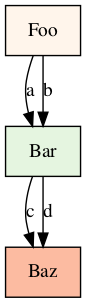
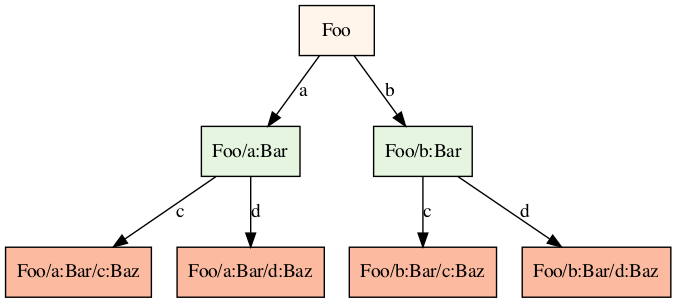

# FIRRTL Annotations

The Scala FIRRTL Compiler (SFC) provides a mechanism to encode arbitrary
metadata and associate it with zero or more "things" in a FIRRTL circuit.  This
mechanism is an _Annotation_ and the association is described using one or more
_Targets_.  Annotations should be viewed as an extension to the FIRRTL IR
specification, and can greatly affect the meaning and interpretation of the IR.

Annotations are represented as a dictionary, with a "class" field which
describes which annotation it is, and a "target" field which represents the IR
object it is attached to. The annotation's class matches the name of a Java
class in the Scala Chisel/FIRRTL code base. Annotations may have arbitrary
additional fields attached. Some annotation classes extend other annotations,
which effectively means that the subclass annotation implies to effect of the
parent annotation.

Annotations are serializable to JSON and either live in a separate file (e.g.,
during the handoff between Chisel and the SFC) or are stored in-memory (e.g.,
during SFC-based compilation).  The SFC pass API requires that passes describe
which targets in the circuit they update.  SFC infrastructure then
automatically updates annotations so they are always synchronized with their
corresponding FIRRTL IR.

An example of an annotation is the `DontTouchAnnotation`, which can be used to
indicate to the compiler that a wire "foo" should not be optimized away.

```json
{
  "class":"firrtl.transforms.DontTouchAnnotation",
  "target":"~MyCircuit|MyModule>foo"
}
```

Some annotations have more complex interactions with the IR. For example the
[BoringUtils](https://javadoc.io/doc/edu.berkeley.cs/chisel3_2.13/latest/chisel3/util/experimental/BoringUtils$.html)
provides FIRRTL with annotations which can be used to wire together any two
things across the module instance hierarchy.

## Motivation

Historically, annotations grew out of three choices in the design of FIRRTL IR:

1) FIRRTL IR is not extensible with user-defined IR nodes.
2) FIRRTL IR is not parameterized.
3) FIRRTL IR does not support in-IR attributes.

Annotations have then been used for all manner of extensions including:

1) Encoding SystemVerilog nodes into the IR using special printfs, an example of
   working around (1) above.
2) Setting the reset vector of different, identical CPU cores, an example of
   working around (2) above.
3) Encoding sources and sinks that should be wired together by an SFC pass, an
   example of (3) above.

## Targets

A circuit is described, stored, and optimized in a folded representation. For
example, there may be multiple instances of a module which will eventually
become multiple physical copies of that module on the die.

Targets are a mechanism to identify specific hardware in specific instances of
modules in a FIRRTL circuit.  A target consists of a circuit, a root module, an
optional instance hierarchy, and an optional reference. A target can only
identify hardware with a name, e.g., a circuit, module, instance, register,
wire, or node. References may further refer to specific fields or subindices in
aggregates. A target with no instance hierarchy is local. A target with an
instance hierarchy is non-local.

Targets use a shorthand syntax of the form:
```
target ::= “~” (circuit) (“|” (module) (“/” (instance) “:” (module) )* (“>” (ref) )?)?
```

A reference is a name inside a module and one or more qualifying tokens that
encode subfields (of a bundle) or subindices (of a vector):
```
reference ::= (name) ("[" (index) "]" | "." (field))*
```

Targets are specific enough to refer to any specific module in a folded,
unfolded, or partially folded representation.

To show some examples of what these look like, consider the following example
circuit. This consists of four instances of module `Baz`, two instances of
module `Bar`, and one instance of module `Foo`:

```firrtl
circuit Foo:
  module Foo:
    inst a of Bar
    inst b of Bar
  module Bar:
    inst c of Baz
    inst d of Baz
  module Baz:
    skip
```

| Folded Module   | Unfolded Modules  |
| --------------- | ----------------- |
|  |  |

Using targets (or multiple targets), any specific module, instance, or
combination of instances can be expressed. Some examples include:

| Target                                 | Description                                                |
| --------                               | -------------                                              |
| <code>~Foo</code>                      | refers to the whole circuit                                |
| <code>~Foo&#124;Foo</code>             | refers to the top module                                   |
| <code>~Foo&#124;Bar</code>             | refers to module `Bar` (or both instances of module `Bar`) |
| <code>~Foo&#124;Foo/a:Bar</code>       | refers just to one instance of module `Bar`                |
| <code>~Foo&#124;Foo/b:Bar/c:Baz</code> | refers to one instance of module `Baz`                     |
| <code>~Foo&#124;Bar/d:Baz</code>       | refers to two instances of module `Baz`                    |

If a target does not contain an instance path, it is a _local_ target.  A local
target points to all instances of a module.  If a target contains an instance
path, it is a _non-local_ target.  A non-local target _may_ not point to all
instances of a module.  Additionally, a non-local target may have an equivalent
local target representation.

## Inline Annotations

The MLIR FIRRTL compiler supports an inline format for annotations as an
extension to the FIRRTL syntax. These inline annotations are helpful for making
single-file annotated FIRRTL code. This is not supported by the Scala FIRRTL
compiler.

Inline annotations are attached to the `circuit`, and are JSON wrapped in `%[`
and `]`.

```firrtl
circuit Foo: %[[{"a":"a","target":"~Foo"}]]
  module Foo:
    skip
```

## Annotations in CIRCT

We plan to provide full support for annotations in CIRCT.  The FIRRTL dialect
current supports:

1) All non-local annotations can be parsed and applied to the correct circuit
   component.
2) Annotations, with and without references, are copied to the correct ground
   type in the `LowerTypes` pass.

Annotations can be parsed using the `--annotation-file` command line argument
to the `firtool` utility.  Alternatively, we provide a non-standard way of
encoding annotations in the FIRRTL IR textual representation.  We provide this
non-standard support primarily to make test writing easier.  As an example of
this, consider the following JSON annotation file:

```json
[
  {
    "target": "~Foo|Foo",
    "hello": "world"
  }
]
```

This can be equivalently, in CIRCT, expressed as:

```firrtl
circuit Foo: %[[{"target":"~Foo|Foo","hello":"world"}]]
  module Foo:
    skip
```

During parsing, annotations are "scattered" into the MLIR representation as
operation or port attributes.  As an example of this, the above parses into the
following MLIR representation:

```mlir
firrtl.circuit "Foo" {
  firrtl.module @Foo() attributes {annotations = [{hello = "world"}]} {
    firrtl.skip
  }
}
```

Targets without references have their targets stripped during scattering since
target information is redundant once annotation metadata is attached to the IR.
Targets with references have the reference portion of the target included in
the attribute.  The `LowerTypes` pass then uses this reference information to
attach annotation metadata to only the _lowered_ portion of a targeted circuit
component.

Annotations are expected to be fully removed via custom transforms, conversion
to other MLIR operations, or dropped. A warning will be emitted if there are
any unused annotations still in the circuit. For example, the `ModuleInliner`
pass removes `firrtl.passes.InlineAnnotation` by inlining annotated modules or
instances. JSON Annotations map to the builtin MLIR attributes. An annotation
is implemented using a DictionaryAttr, which holds the class, target, and any
annotation specific data.

## Annotations

Annotations here are written in their JSON format. A "reference target"
indicates that the annotation could target any object in the hierarchy,
although there may be further restrictions in the annotation.

[include "Dialects/FIRRTLAnnotations.md"]

## Attributes in SV

Some annotations transform into attributes consumed by non-FIRRTL passes.  This
section describes well-defined attributes used by HW/SV passes.


### firrtl.moduleHierarchyFile

Used by HWExportModuleHierarchy.  Signifies a root from which to dump the module
hierarchy as a json file. This attribute is a list of files to output to, and
has type `ArrayAttr<OutputFileAttr>`.

The exported JSON file encodes a recursive tree of module instances as JSON
objects, with each object containing the following members:

- `instance_name` - A string describing the name of the instance. Note that the
  root module will have its `instance_name` set to the module's name.
- `module_name` - A string describing the name of the module.
- `instances` - An array of objects, where each object is a direct instance
  within the current module.

### firrtl.extract.assert

Used by SVExtractTestCode.  Specifies the output directory for extracted
modules. This attribute has type `OutputFileAttr`.

### firrtl.extract.assume

Used by SVExtractTestCode.  Specifies the output directory for extracted
modules. This attribute has type `OutputFileAttr`.

### firrtl.extract.cover

Used by SVExtractTestCode.  Specifies the output directory for extracted
modules. This attribute has type `OutputFileAttr`.

### firrtl.extract.assert.bindfile

Used by SVExtractTestCode.  Specifies the output file for extracted
modules' bind file. This attribute has type `OutputFileAttr`.

### firrtl.extract.assume.bindfile

Used by SVExtractTestCode.  Specifies the output file for extracted
modules' bind file. This attribute has type `OutputFileAttr`.

### firrtl.extract.cover.bindfile

Used by SVExtractTestCode.  Specifies the output file for extracted
modules' bind file. This attribute has type `OutputFileAttr`.

### firrtl.extract.[cover|assume|assert].extra

Used by SVExtractTestCode.  Indicates a module whose instances should be
extracted from the circuit in the indicated extraction type.
