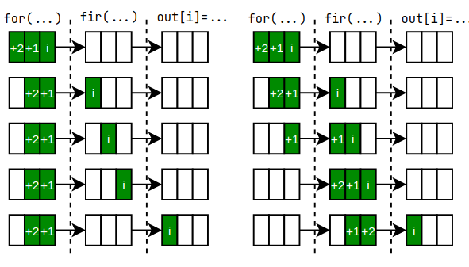
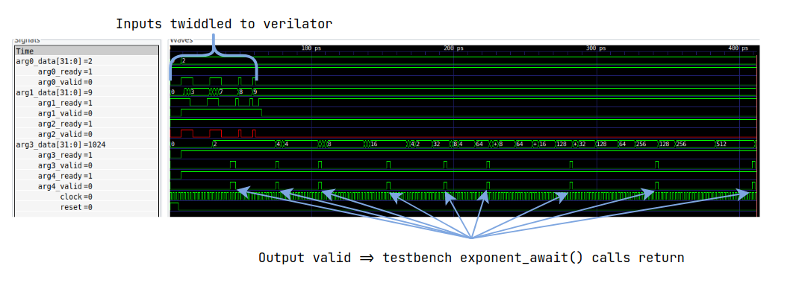

# HLT Rationale

This document describes various design points of the HLT framework, why they are
the way they are, and current status.  This follows in the spirit of other
[MLIR Rationale docs](https://mlir.llvm.org/docs/Rationale/).

## Introduction

HLT (High Level Testing) is an attempt at introducing a HLS testbench workflow similar to what is found in i.e. Xilinx Vivado. Here, a single testbench described in a high-level language can be used to test both a software implementation of an HLS kernel as well as its hardware representation(s).

A key notion in this test flow is that calling an HLS kernel has asynchronous semantics. This is done to allow for a software testbench to be able to stimulate a hardware kernel in the manner which we'd expect it to be used in the final system.

As a motivating example, consider the test bench shown below, wherein a function fir is called within a loop.

```python
out = []
for i in range(3):
    out[i] = fir(...)
check(out)
```

If the test bench is executed as-is, having sequential semantics, sequential invocations of fir in subsequent loop iterations will be blocking, due to the dependency between the call of fir and the write to out[i]. Next, say that fir is a hardware model containing three pipeline stages. Given a sequentially executing test bench, this results in simulation semantics shown below. For each loop iteration. fir must ingest the set of input parameters and execute until a value is available on its output.

<p align="center"></p>

If we break the dependency between returning from fir and executing subsequent loop iterations, fir calls within the loop will be asynchronous in nature. In such case, invocations of fir are now only dependent on the simulation model being ready to accept inputs, and multiple invocations of fir may be active at once. Not only does this mimic how the pipelined kernel would be used in hardware, it may also significantly speed up overall test execution, due to the overlapping of test bench- and simulation execution, given that these can execute in separate threads.

## How does it work?

Currently, two main pieces exist:
- **Simulation library**:
  - The job of the simulation library is to implement:
    - How are inputs and outputs twiddled into the simulator
    - When is the simulator run
  - In the simulation library, we have:
    - **SimRunner**: Executing in a separate thread from the testbench, this is responsible for driving the testbench. Based on a set of simple rules, it will push or pop inputs into the simulator, and step the simulator.
    - **SimDriver**: Called from the testbench thread, this communicates with the SimRunner through thread-safe queues to coordinate invocations of the testbench functions. 
    - **SimInterface**: This is the top-level interface for any simulator. It specifies an interface for pushing/popping values from the simulator and for defining when inputs and outputs are ready from the simulator.
    - **Dialect-specific simulator transactors:** These transactors are intended to incrementally add more semantics to the simulator. For instance, we have the verilator wrapper, which defines stuff such as instantiation of a verilated model, clocking and resetting. The handshake wrapper adds additional semantics in how sets of Verilator ports are collected into bundles and actuated on when the simulator is pushing inputs or popping outputs.
- **WrapGen**
  - WrapGen is intended to be a tool for generating a wrapper that couples kernel-dependent simulator code with the simulation library. This is done by taking in a reference function (currently this is just assumed to be a builtin.func) and a kernel function. Based on this, WrapGen will generate a `.cpp` file that is used to build the simulator.
  - This commit shows two wrapper implementations - one for a kernel function being a `builtin.func` and one for `handshake.func`. `builtin.func` is executed by linking to its LLVMIR implementation; `handshake.func` uses Verilator as a simulation backend


## Example:
We'd like to HLS compile the following function - our kernel:
```mlir
func @exponent(%arg0: i32, %arg1: i32) -> (i32) {
  %c-1_i32 = constant -1 : i32
  %c1_i32 = constant 1 : i32
  %0:2 = scf.while (%arg2 = %arg0, %arg3 = %arg1) : (i32, i32) -> (i32, i32) {
    %1 = cmpi sgt, %arg3, %c1_i32 : i32
    scf.condition(%1) %arg2, %arg3 : i32, i32
  } do {
  ^bb0(%arg2: i32, %arg3: i32):  // no predecessors
    %1 = muli %arg2, %arg0 : i32
    %2 = addi %arg3, %c-1_i32 : i32
    scf.yield %1, %2 : i32, i32
  }
  return %0#0 : i32
}
```
A testbench for this will be as follows. Here, we're verifying based on printouts of the values returned by `exponent_await`.
```
func private @exponent_call(i32, i32) -> ()
func private @exponent_await() -> (i32)
func private @printI64(i32)
func private @printComma()
func @test_exponent() -> i32 {
  %c0 = constant 0 : index
  %c1 = constant 1 : index
  %c10 = constant 10 : index
  %c2_i32 = constant 2 : i32
  %c0_i32 = constant 0 : i32

  // Call
  scf.for %i = %c0 to %c10 step %c1 {
    %0 = index_cast %i : index to i32
    call @exponent_call(%c2_i32, %0) : (i32, i32) -> ()
  }

  // Await
  scf.for %i = %c0 to %c10 step %c1 {
    %0 = index_cast %i : index to i32
    %res = call @exponent_await() : () -> (i32)
    call @printI64(%res) : (i32) -> ()
    call @printComma() : () -> ()
  }

  // CHECK: 2, 2, 4, 8, 16, 32, 64, 128, 256, 512,

  return %c0_i32 : i32
}
```
Such asynchronous test could be generated from a synchronous version (with a single `for` loop), but that is a problem to be solved outside of this PR.

In the case of HLS compiling the kernel to `handshake`, the following wrapper will be generated:
```C++
// This file is generated. Do not modify!
#include "Vexponent.h"
#include "circt/Tools/hlt/Simulator/HandshakeSimInterface.h"
#include "circt/Tools/hlt/Simulator/SimDriver.h"
#include "cstdint"

using TArg0 = IData;
using TArg1 = IData;
using TInput = std::tuple<TArg0, TArg1>;

using TRes0 = IData;
using TOutput = std::tuple<TRes0>;

using TModel = Vexponent;
using exponentSimInterface = HandshakeSimInterface<TInput, TOutput, TModel>;

class exponentSim : public exponentSimInterface {
public:
  exponentSim() : exponentSimInterface() {
    // --- Generic Verilator interface
    interface.clock = &dut->clock;
    interface.reset = &dut->reset;

    // --- Handshake interface
    inCtrl->readySig = &dut->arg2_ready;
    inCtrl->validSig = &dut->arg2_valid;
    outCtrl->readySig = &dut->arg4_ready;
    outCtrl->validSig = &dut->arg4_valid;

    // --- Model interface
    // - Input ports
    addInputPort<HandshakeDataInPort<TArg0>>("arg0", &dut->arg0_ready, &dut->arg0_valid, &dut->arg0_data);
    addInputPort<HandshakeDataInPort<TArg1>>("arg1", &dut->arg1_ready, &dut->arg1_valid, &dut->arg1_data);

    // - Output ports
    addOutputPort<HandshakeDataOutPort<TRes0>>("arg3", &dut->arg3_ready, &dut->arg3_valid, &dut->arg3_data);
  };
};

using TSim = exponentSim;
using TSimDriver = SimDriver<TInput, TOutput, TSim>;
static TSimDriver *driver = nullptr;

void init_sim() {
  assert(driver == nullptr && "Simulator already initialized !");
  driver = new TSimDriver();
}

extern "C" void exponent_call(int32_t in0, int32_t in1) {
  if (driver == nullptr)
    init_sim();
  TInput input{in0, in1};
  driver->push(input); // non-blocking
}

extern "C" int32_t exponent_await() {
  TOutput output = driver->pop(); // blocking
  return std::get<0>(output);
}
```

Any wrapper would mostly follow the style of the above. Initially, a set of types is defined, which will be used in instantiating simulation library base class(es) which the simulator relies. Next, the simulator itself is defined. In here, we're connecting 
1. The Verilator interface (clock and reset)
2. The handshake interface (in- and output control signals)
3. The handshake I/O ports

The rest of the file implements the free functions which we'll call from the testbench.

Currently, this is all driven from within a LIT test, but could be collapsed into something less verbose.
```

// === Lower testbench to LLVMIR
// RUN:   mlir-opt %s -convert-scf-to-std                                      \
// RUN:               -convert-std-to-llvm                                     \
// RUN:               -reconcile-unrealized-casts > ${TESTNAME}_tb.mlir

// === Build handshake simulator
// RUN: mlir-opt --convert-scf-to-std %s.kernel                                \
// RUN: | circt-opt -lower-std-to-handshake                                    \
// RUN: | tee ${TESTNAME}_handshake.mlir                                       \
// RUN: | circt-opt -canonicalize='top-down=true region-simplify=true' -handshake-insert-buffer='strategies=all' -lower-handshake-to-firrtl \
// RUN: | firtool --format=mlir --lower-to-hw --verilog > ${TESTNAME}.sv
// RUN: hlt-wrapgen --ref %s.kernel --kernel ${TESTNAME}_handshake.mlir --name ${TESTNAME} -o .
// RUN: cp %circt_obj_root/tools/hlt/Simulator/hlt_verilator_CMakeLists.txt CMakeLists.txt
// RUN: cmake -DHLT_TESTNAME=${TESTNAME} -DCMAKE_BUILD_TYPE=RelWithDebInfo . 
// RUN: make all -j$(nproc) 

// === JIT execute the testbench
// RUN: mlir-cpu-runner                                                        \
// RUN:     -e test_${TESTNAME} -entry-point-result=i32 -O3                    \
// RUN:     -shared-libs=%llvm_shlibdir/libmlir_c_runner_utils%shlibext        \
// RUN:     -shared-libs=%llvm_shlibdir/libmlir_runner_utils%shlibext          \
// RUN:     -shared-libs=libhlt_${TESTNAME}%shlibext ${TESTNAME}_tb.mlir       \
// RUN: | FileCheck %s
```

The `hlt_verilator_CMakeLists.txt` contains a call to Verilator, verilating the lowered kernel. This is all compiled into a shared library `${TESTNAME}_tb.so` and passed to `mlir-cpu-runner`, to provide definitions for `exponent_call` and `exponent_await`.

Executing this lit test will  generated a `.vcd` file such as the following, which demonstrates the decoupling of pushing inputs to the simulator, and returning outputs:

<p align="center"></p>

## Debugging HLT simulators
It might happen that you would want to manually write a `main` function to access the `call/await` functions exposed by the wrapped kernel. To do so, first create a kernel wrapper through `hlt-wrapgen` and copy the `hlt_verilator_CMakeLists.txt` file into the directory where you placed the wrapper and plan to verilate the HDL of the kernel.

First, add a main function. To avoid having new files, navigate to the `${TESTNAME}.cpp` wrapper and add it:
```c++
int main() {
  for (int i = 0; i < 10; i++)
    ${TESTNAME}_call(...);
  for (int i = 0; i < 10; i++)
    ... = ${TESTNAME}_await();
}
```
Then, open the `hlt_verilator_CMakeLists.txt` copied file and modify the `add_library` line to:
> `add_executable(${HLT_LIBNAME} "${HLT_TESTNAME}.cpp")`

You should now be able to run CMake configure and build, and have an executable which can be debugged as any other C++ project.

## Why not use the `async` dialect?
I was initially looking at having the asynchronicity implicit (as opposed to having two separate call/await loops) by using `async.execute` and calling the simulator from within there. However, the main issue with this is that it interferes with how the simulation library currently works;

- When inputs are present *and no output is yet awaited*, input values are twiddled into the simulator. The simulator is *not* run when there are no more inputs available.
- Only when an output is expected (an *await* call has been executed) is the simulator continuously run, until all of the expected outputs have arrived.

This is how we can ensure that i.e. a pipeline fills within the hardware model, without creating unintentional bubbles. Using the `async` dialect, we'd have to implement a custom `async` dialect runtime library to be able to communicate the above semantics to the simulator.
