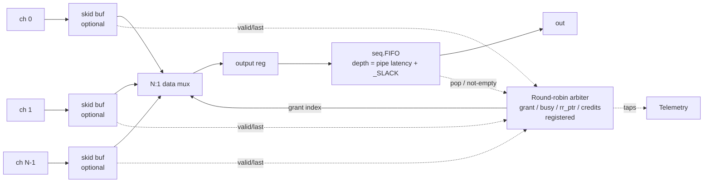

# Component Design: `ChannelArbiter`

## 1. Summary
`ChannelArbiter` (in `esiaccel/components/channel_arbiter.py`) is a pipelined,
list-aware N:1 ESI channel multiplexer. It is an opt-in alternative to the
recursive **combinational** `ChannelMux2` tree in `pycde.esi.ChannelMux`, built
as a **flat, registered, round-robin arbiter** whose datapath is fully
feed-forward: downstream `ready` never reaches the arbiter combinationally — an
output FIFO plus a credit counter decouple the two.  It (a) keeps multi-flit
list messages contiguous, (b) closes timing at high N, (c) is pipelined by a
parameter, and (d) emits telemetry. `pycde.esi.ChannelMux` is left untouched.

## 2. Motivation
- **FMax.** `ChannelMux` is a `ceil(log2 N)`-deep tree of combinational
  `ChannelMux2` arbiters. Both the forward valid/data path *and* the backward
  `ready` path cross every level combinationally — in an internal build results
  in one die-spanning net whose `ready` feedback is the critical path.
- **List integrity.** The combinational priority tree may re-select an input on
  any cycle, so flits of two different list messages can interleave. There is no
  mechanism to hold a grant until the flit tagged `last`.

## 3. Requirements
1. Message boundaries preserved — once granted, an input holds the output until a
   flit with `last` transfers.
2. Feed-forward — no combinational path from `out_ready` into input selection;
   an output FIFO plus a credit counter provide the decoupling.
3. Optional input buffering.
4. Telemetry for observability.
5. Uniform handling of single-flit messages (every flit is `last`) and list
   windows.

## 4. Interface
```python
def ChannelArbiter(
    input_channels: List[ChannelSignal],
    clk: ClockSignal,
    rst: Signal,
    *,
    appid: Optional[AppID] = None,            # AppID for the arbiter instance
    output_fifo_depth: Optional[int] = None,  # default: pipe latency + _SLACK
    buffer_inputs: bool = True,               # optional per-input skid buffer
    mux_pipeline_levels: Optional[int] = None,  # pipeline the N:1 select mux tree
    telemetry: bool = True,
) -> ChannelSignal
```
Sequential (needs `clk`/`rst`), unlike `ChannelMux`. All inputs share type and
signaling (ValidReady); output type equals input type. `output_fifo_depth` must
be greater than the pipeline latency (one output register plus any
selection-mux pipeline latency); it is validated and defaults to that plus a
small internal slack (the private, class-scoped `ChannelArbiterImpl._SLACK`,
currently 2). A single input is returned unchanged.

## 5. Last-flit detection (auto from type)
Helper `_flit_last`:
- Inner type is a `Window` whose lowered frame struct exposes a `last` field ->
  read `data.unwrap()["last"]` (the `last` convention on `Window`, `types.py`).
- Plain (non-window) data -> constant `1` — each transfer is a complete message.
- `Window` with no discoverable `last` field -> **raise** (fail loud), never
  silently interleave list flits.

## 6. Architecture

**Feed-forward output stage.** The mux output is latched by a single register
(fixed latency, *no* backpressure) into a seq `FIFO` (`seq.py`,
`push`/`pop`/`full`/`empty`); the FIFO output is wrapped as a ValidReady channel
for `out`. The FIFO beat is just the raw payload bits — for list/window payloads
the `last` flag is already part of those bits, so it is not stored separately.
The decoupling that makes the datapath feed-forward is the **FIFO plus credit
counter**, not the register: because nothing downstream can stall the arbiter,
the FIFO must have room for every in-flight beat, hence `depth = pipe_latency +
_SLACK`, where `pipe_latency` is the one output register plus any selection-mux
pipeline latency. A **credit counter** in the arbiter tracks
launched-but-not-yet-drained beats:
- `credit = depth`; decrement when the arbiter launches a beat, increment when
  the FIFO is popped downstream.
- The arbiter may launch only while `credit > 0`.

**Zero-width (token) payloads.** A zero-width (`i0` "token") payload is the
datapath case minus the data: there is nothing to buffer, so there is no
pipeline and no FIFO -- the **credit counter itself is the token buffer**.
`out_valid = credit < depth` (i.e. a beat is in flight) and `pop` increments
credit exactly as in the datapath case, so the feed-forward property is
unchanged. No filler beat is fabricated and no FIFO is built (`seq.FIFO`
requires a non-zero width anyway).

Downstream `ready`/pop reaches the arbiter only as a registered credit
increment — never combinationally. That is what makes the component feed-forward
regardless of the mux-tree pipeline depth.

**Pipelineable selection mux.** By default the 1-of-N data selection is a flat
`pycde.constructs.Mux(grant, *data)` (a single `hw.array_get`, which CIRCT
lowers to an unpipelined mux tree). For very large fan-in that wide mux becomes
the Fmax bottleneck. Setting `mux_pipeline_levels = k` instead builds the
selection as an explicit balanced binary mux tree (2:1 nodes, one `grant` bit
per level) with a pipeline register after every `k` levels; the `grant` bits are
pipelined alongside the partial results so each level selects with the
correctly-delayed index. The resulting `ceil(log2 N)/k`-ish cycles of latency
are absorbed by the output FIFO / credit counter (the default `output_fifo_depth`
grows to cover it), so throughput and correctness are unchanged — only latency
grows. This selection-mux pipelining is separate from the single output register
between the mux and the FIFO, which is always present. The narrow arbitration
path (valid mux + round-robin priority encoder) remains combinational, but the
priority encoder is itself a **balanced binary tree** (`O(log N)` depth, priority
to the lower index) rather than an `O(N)` chain, so it scales to large `N`
without dominating the arbitration path — and it is far narrower than the data
mux regardless.

## 7. Control — round-robin arbitration
`round_robin(valids, start)` is **purely combinational** — it has no state of
its own. It returns `(winner, any_valid)`: the lowest-index input that is *both*
valid and at index `>= start`, or — if none qualifies — the lowest-index valid
input overall (the wrap-around). It is two balanced priority encoders (§6, one
over `valids & (index >= start)` and one over all `valids`) plus a mux, so a full
cyclic scan is `O(log N)` deep. `start` is what rotates priority, making the
arbiter fair rather than a fixed lowest-index-wins scheme.

The state lives in the arbiter's registers, updated once per cycle by the
next-state logic below:
- `busy` (1 bit) — the only genuine FSM state: whether the output is currently
  owned by an in-progress message.
- `grant` (`ceil(log2 N)` bits) — index of the owning input. **This is the
  register that holds the current grant.**
- `rr_ptr` (`ceil(log2 N)` bits) — fairness pointer; the `start` fed to the idle
  scan.
- `credit` (§6) — the output-FIFO occupancy budget that gates launching.

Each cycle the arbiter evaluates two speculative scans —
`round_robin(valids, rr_ptr)` for the idle case and
`round_robin(valids & ~grant_oh, grant+1)` for a back-to-back re-grant — and the
1-bit `busy` state machine chooses between holding, latching, or dropping the
grant. Each scan is a separate instance (`rr_idle` / `rr_next`) of a standalone
combinational `RoundRobinArbiter` module, so both appear in the waveform
hierarchy for debug:

| State | Condition | Next state | `grant` | `rr_ptr` |
|-------|-----------|------------|---------|----------|
| **IDLE** (`~busy`) | no input valid | IDLE | hold | hold |
| **IDLE** (`~busy`) | some input valid | BUSY | `round_robin(valids, rr_ptr)` | hold |
| **BUSY** | flit not `last` (or launch stalled) | BUSY | hold | hold |
| **BUSY** | `last` flit, another input waiting | BUSY | `round_robin(valids & ~grant_oh, grant+1)` | `grant+1` |
| **BUSY** | `last` flit, none waiting | IDLE | (don't-care) | `grant+1` |

Points the table glosses over:

- **One-cycle arm.** `grant`/`busy` are registered, so the cycle an idle winner
  is chosen only *latches* the grant; the first flit launches the next cycle
  (`launch = busy & sel_valid & credit>0`).
- **Re-grant with no bubble, and why the mask.** For list contiguity the grant is
  held until a *launched* flit is tagged `last` (`reend = busy & msg_end`). On
  that same cycle the next message is already arbitrated from `grant+1`, so
  back-to-back messages see zero idle cycles. The scan masks the current owner
  (`valids & ~grant_oh`) because that input still asserts `valid` on its
  last-flit cycle (the flit is only consumed on the clock edge) — an unmasked
  scan would re-select the input that is about to drain and wedge `busy` on it.
- **Fairness.** `rr_ptr` advances to `grant+1` (wrapping `N-1 -> 0`) at every
  message end, so the input just served is scanned *last* next time; no requester
  is starved by a busier lower-index neighbour, and every waiting input is served
  within one lap of the pointer.

**Backpressure to producers.** `ready[i] = busy & grant_oh[i] & (credit>0)` — a
single AND. `grant_oh[i]` is a **registered per-input one-hot** decode of the
next grant (one register each), so this potentially high-fanout signal is a
dedicated register bit near each producer rather than a shared combinational
decode of `grant`. With `buffer_inputs=True` a 1-deep skid buffer localizes it
further.

## 8. Input buffering (optional)
`buffer_inputs=True` (default, recommended for FMax) inserts a 1-deep skid buffer
per input, localizing each producer's `ready`. Set it `False` when producers
already batch/prepare their messages (e.g. accumulate a whole list before
presenting it). Correctness and list-integrity are identical either way; only the
timing/area tradeoff differs.

## 9. Telemetry
Emitted via `Telemetry.report_signal(clk, rst, AppID, data)` when
`telemetry=True`. Each signal gets a leaf `AppID`; instances are disambiguated by
their hierarchical appid path, so no per-instance name prefix is needed:
- `selectedChannel` — registered `grant` index (current owner).
- `busy` — output currently owned.
- `grantCount_<i>` — served beats per input (traffic distribution / starvation).
- `maxListLen` — running max of per-message flit count.
- `totalFlits`, `totalMessages` — host computes average list length =
  `totalFlits / totalMessages` (avoids a hardware divider).
- `arbSwitches` — number of grant changes (contention indicator).
- `inflightHighWater` — max output in-flight occupancy (`depth - credit`) to
  right-size `output_fifo_depth`.

Counters use `constructs.Counter`; max/high-water use a compare-and-update
register. Zero hardware cost when `telemetry=False`.
